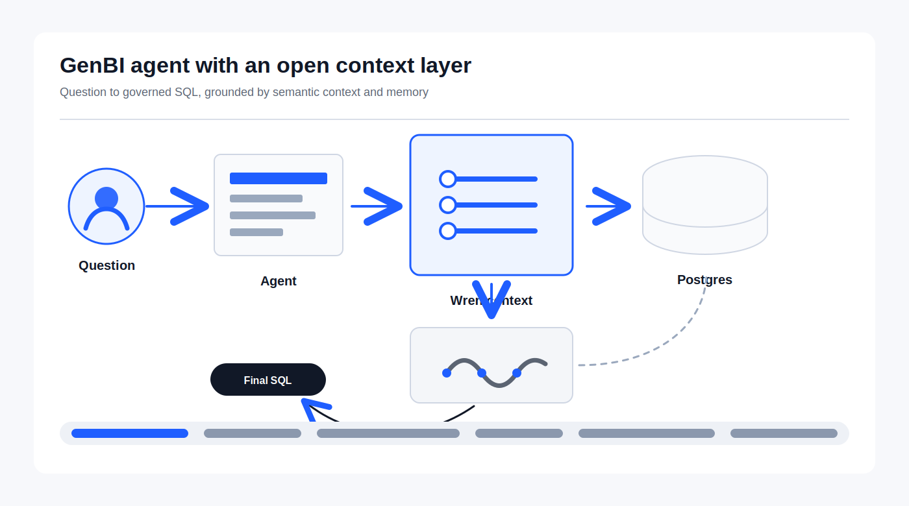

# Building a Small GenBI Agent With an Open Context Layer

I wanted to build a simple Generative BI demo where a user can ask a business
question in plain English and get an answer from a real database.

Not a mock answer. Not a hard-coded response. A real answer backed by SQL.

The harder part was not the LLM call. The harder part was giving the LLM the
right business context so it does not guess table names, invent joins, or write
SQL directly against raw tables.

That is what this project is about.



Code:

```text
https://github.com/commitbyrajat/genbi-open-context-layer.git
```

Repository owner and committer:

```text
GitHub: @commitbyrajat
```

## The Idea

Most text-to-SQL demos start with this flow:

```text
User question -> LLM -> SQL -> Database
```

It looks clean, but it is risky.

The model has to understand the schema, the meaning of each column, the joins,
and the business rules. If that context is missing or stale, the SQL will also
be wrong.

So I used a slightly different flow:

```text
User question
  -> Wren semantic layer
  -> LanceDB memory
  -> Pydantic AI agent
  -> Wren SQL tools
  -> Postgres
```

The semantic layer is the important part. It gives the agent a controlled view
of the database. The model talks to business concepts instead of guessing raw
database structure.

## What This Project Uses

This demo uses a small employee analytics database in Postgres. The agent is
written in Python with Pydantic AI. Wren is used as the open context layer and
semantic layer. LanceDB stores the memory index. MinIO is used as the local
S3-compatible backend for LanceDB.

The main pieces are:

- Postgres for the employee demo data.
- Wren for the semantic model and SQL planning.
- LanceDB for schema and query memory.
- MinIO for object storage.
- Pydantic AI for the agent loop.
- OpenAI as the model provider.

The local Docker setup starts Postgres and MinIO. It also creates the MinIO
bucket used by LanceDB:

```text
s3://wren-lancedb/memory
```

## Architecture and Tech Stack

This project is a small GenBI agent built around WrenAI's open context layer.
WrenAI describes itself as the layer that gives AI agents the business meaning
that plain database schemas do not carry: semantics, examples, memory,
governance, and SQL execution primitives.

In simple terms, this project has four layers.

### 1. Data Layer

Postgres is the source database.

In the local demo, Docker Compose starts a Postgres container with the employee
analytics schema and seed data from:

```text
init/01_employee_schema.sql
```

The Wren profile in `agent/db/profiles/employee_pg.yml` points to that database:

```text
host=localhost
port=5432
database=employee_demo
user=wren
```

The agent should not talk to this database directly. It should go through Wren.

### 2. Open Context Layer

This is the Wren part.

Wren keeps the business meaning of the data in a project under:

```text
agent/db/
```

Important files:

```text
agent/db/wren_project.yml
agent/db/relationships.yml
agent/db/target/mdl.json
```

The generated `mdl.json` is the contract the agent uses. It tells Wren what
models exist, how fields should be understood, and how relationships work.

WrenAI's upstream repo includes the core engine, Python CLI/SDK, MDL schema,
agent SDK integrations, and skills. In this project, the most important pieces
from that stack are:

- `wrenai`: Wren CLI and Python package.
- `wren-pydantic`: Pydantic AI integration.
- Wren MDL: the semantic model used to ground SQL generation.
- Wren core: the Rust semantic engine.
- Apache DataFusion: the query planning and optimization foundation used by
  Wren core.
- PyO3 bindings: the bridge that exposes the Rust engine to Python.
- Wren memory tools: context retrieval and query recall.
- Wren execution tools: dry planning and governed query execution.

The agent uses Wren tools instead of raw database access:

```text
wren_fetch_context
wren_recall_queries
wren_dry_plan
wren_query
wren_store_query
```

This is the "open context layer" in practice. The model does not need to
rediscover the business meaning of the database every time. It asks Wren for
the right context, validates SQL through Wren, and executes through Wren.

One detail I like in Wren's design is the split between Rust and Python.

The semantic engine lives in Rust, where Wren can use Apache DataFusion for SQL
analysis, planning, and optimization. Python still gets a clean developer
experience because the Rust engine is exposed through PyO3 bindings. So from
this demo, it feels like using a normal Python SDK, but under the hood the
semantic planning work is backed by a Rust/DataFusion core.

That matters for GenBI because the context layer is not just prompt text. It is
also a real query planning layer that can validate and transform SQL before it
touches the database.

### 3. Memory Layer

LanceDB stores the Wren memory index.

Memory includes schema context and useful natural-language-to-SQL examples.
This helps the agent answer new questions with better grounding.

For this project, LanceDB is backed by MinIO:

```text
s3://wren-lancedb/memory
```

MinIO runs locally through Docker Compose and behaves like an S3-compatible
object store. This makes the memory path closer to a production setup than a
local folder.

The file that indexes memory is:

```text
agent/index_memory.py
```

The adapter that makes `wren-pydantic` use S3-backed LanceDB memory is:

```text
agent/wren_memory.py
```

That adapter exists because the current `wren-pydantic` project flow expects
local memory under `db/.wren/memory`, while this project stores memory in MinIO.

### 4. Agent Layer

The agent is in:

```text
agent/main.py
```

It uses:

- Pydantic AI for the agent loop.
- OpenAI chat model for reasoning and tool selection.
- Wren toolkit for context, planning, query execution, and memory.

For every question, the agent prints:

- the question,
- tool calls,
- summarized tool returns,
- final SQL sent to `wren_query`,
- final answer.

It does not print hidden model chain-of-thought. The useful debug surface is the
tool trace and the SQL that actually reached Wren.

### End-to-End Request Flow

Here is the runtime flow:

```text
User question
  -> Pydantic AI agent
  -> wren_fetch_context / wren_recall_queries
  -> LanceDB memory on MinIO
  -> wren_dry_plan
  -> wren_query
  -> Wren semantic layer
  -> Postgres
  -> final answer
```

The model decides which tool to call next, but Wren owns the context and SQL
boundary. That is the key design choice.

### Tech Stack Summary

| Layer | Technology | Purpose |
| --- | --- | --- |
| Database | Postgres | Stores employee analytics data |
| Local infrastructure | Docker Compose | Runs Postgres, MinIO, and bucket setup |
| Object storage | MinIO | S3-compatible backend for LanceDB |
| Vector memory | LanceDB | Stores schema memory and query examples |
| Context layer | WrenAI / Wren MDL | Business semantics, relationships, governed SQL |
| Semantic engine | Wren core | Rust engine for MDL analysis and SQL planning |
| Query engine foundation | Apache DataFusion | Planning, optimization, and SQL transformation base |
| Python bridge | PyO3 | Exposes Wren's Rust core to Python packages |
| Agent framework | Pydantic AI | Tool-using agent loop |
| Model provider | OpenAI | Natural language reasoning and tool selection |
| Python package manager | uv | Dependency management and command execution |

## Why Wren Sits in the Middle

I do not want the model to directly reason over every raw table.

Instead, the Wren project defines the business-facing model. It has the project
configuration, relationships, and generated manifest. The agent uses Wren tools
such as:

- `wren_fetch_context`
- `wren_recall_queries`
- `wren_dry_plan`
- `wren_query`
- `wren_store_query`

This makes the agent more predictable.

Before it runs SQL, it can fetch context. Before it executes SQL, it can dry
plan the query. When it finally queries the database, the SQL goes through
Wren's semantic layer.

That is much better than asking the LLM to "please be careful".

## Why Memory Is in LanceDB

The agent needs memory for two things:

1. Schema context.
2. Useful natural-language-to-SQL examples.

In this project, memory is stored in LanceDB. Instead of keeping it in a local
folder, the memory path points to MinIO:

```text
s3://wren-lancedb/memory
```

This is useful because the memory store becomes more portable. A containerized
agent can use the same memory location as a local script, as long as the S3
endpoint is configured correctly.

For local execution from the host machine:

```bash
AWS_ENDPOINT=http://localhost:9000
AWS_ENDPOINT_URL=http://localhost:9000
```

For a container running inside Docker Compose:

```bash
AWS_ENDPOINT=http://minio:9000
AWS_ENDPOINT_URL=http://minio:9000
```

That small difference matters.

## The Part I Had to Patch Around

The current `wren-pydantic` setup auto-detects local memory under:

```text
db/.wren/memory
```

For this demo, I wanted memory in MinIO-backed LanceDB instead. So the project
has a small adapter in:

```text
agent/wren_memory.py
```

That adapter builds the normal Wren toolkit, but it provides a custom memory
provider that opens LanceDB at:

```text
s3://wren-lancedb/memory
```

This keeps the rest of the agent simple. `main.py` only needs:

```python
toolkit = build_toolkit("./db")
```

The agent gets memory-enabled Wren tools without depending on the local
`.wren/memory` folder.

## Running the Project

Here is the full flow I use from a fresh clone.

### 1. Clone the repo

```bash
git clone https://github.com/commitbyrajat/genbi-open-context-layer.git
cd genbi-open-context-layer
```

### 2. Start Postgres and MinIO

```bash
docker compose up -d
```

Check that both services are running:

```bash
docker compose ps
```

You should see `postgres`, `minio`, and the bucket initializer. The initializer
may exit after creating the bucket, and that is fine.

MinIO console is available here:

```text
http://localhost:9001
username: minioadmin
password: minioadmin
```

### 3. Install the Python dependencies

```bash
cd agent
uv sync
```

### 4. Create the agent `.env` file

At minimum, add your model key:

```bash
OPENAI_API_KEY=your-key
```

The local LanceDB and MinIO values are already defaulted in code, but these are
the important settings if you want to make them explicit:

```bash
WREN_MEMORY_PATH=s3://wren-lancedb/memory
AWS_ENDPOINT=http://localhost:9000
AWS_ENDPOINT_URL=http://localhost:9000
AWS_ACCESS_KEY_ID=minioadmin
AWS_SECRET_ACCESS_KEY=minioadmin
AWS_DEFAULT_REGION=us-east-1
ALLOW_HTTP=true
```

### 5. Build the Wren context

This generates the Wren manifest at `agent/db/target/mdl.json`.

```bash
uv run wren context build
```

### 6. Index memory into LanceDB

This writes schema memory and seed query examples to:

```text
s3://wren-lancedb/memory
```

```bash
uv run python index_memory.py --mdl db/target/mdl.json
```

You should see output similar to:

```text
Indexed ... schema items, ... seed queries at s3://wren-lancedb/memory.
```

### 7. Smoke test the setup

First confirm the Python files compile:

```bash
uv run python -m py_compile main.py index_memory.py wren_memory.py
```

Then confirm the Wren project can still build:

```bash
uv run wren context build
```

From the repository root, you can also validate the Docker Compose file:

```bash
cd ..
docker compose config --quiet
cd agent
```

### 8. Run the agent

```bash
uv run main.py
```

The script runs the questions listed in `agent/main.py`. For every question it
prints the tool trace, the final SQL sent to `wren_query`, and the final answer.

### 9. What to check in the output

A good run should show:

- `wren_fetch_context` or `wren_recall_queries` before SQL execution.
- `wren_dry_plan` for SQL validation.
- `wren_query` with the final SQL.
- A final answer based on returned rows.

If the agent returns an incorrect answer, inspect the `Final SQL` block first.
That is the SQL that actually reached Wren.

### 10. Clean up local services

Stop containers but keep volumes:

```bash
docker compose down
```

Remove containers and local volumes:

```bash
docker compose down -v
```

Use `-v` only when you are fine deleting the local Postgres data and MinIO
LanceDB memory.

## What the Agent Prints

The agent asks a set of employee analytics questions from `main.py`.

For each question, it prints:

- the question,
- the observable tool trace,
- tool return summaries,
- the final SQL sent to `wren_query`,
- and the final answer.

It does not print hidden model chain-of-thought. That is intentional. The useful
debugging information here is the tool path and the SQL that was actually sent
to Wren.

A typical flow looks like this:

```text
Question
Trace
- call wren_fetch_context: ...
- return wren_fetch_context: ...
- call wren_dry_plan: ...
- call wren_query: ...

Final SQL
...

Answer
...
```

This is enough to debug most BI agent issues. If the answer is wrong, the first
thing to inspect is the final SQL and the context tools used before it.

## Reading a Real `uv run main.py` Output

Here is how to read the output from one run of this project.

The first question is simple:

```text
--- Question 1 ---
Who is the manager of Vikram Nair
```

The trace starts with memory recall:

```text
- call wren_recall_queries: question='Who is the manager of Vikram Nair', limit=3
- return wren_recall_queries: 3 item(s)
```

This means the agent searched LanceDB memory for similar past
natural-language-to-SQL examples. It found three items. The model can use those
examples as guidance before writing SQL.

Then it executes the final query:

```sql
SELECT manager.employee_name AS manager_name
FROM employees AS emp
JOIN employees AS manager ON emp.manager_id = manager.employee_id
WHERE emp.employee_name = 'Vikram Nair'
```

The tool return says:

```text
- return wren_query: 1 row(s), columns=manager_name
```

That is a clean result. One row came back, and the final answer is:

```text
The manager of Vikram Nair is Neha Rao.
```

For more analytical questions, the trace is longer. For example:

```text
Which departments have the highest salary cost but lowest average performance?
```

The agent does three important things:

```text
- call wren_recall_queries
- call wren_fetch_context
- call wren_dry_plan
```

`wren_recall_queries` looks for similar examples in memory.

`wren_fetch_context` asks Wren for schema and business context. In the sample
output, it returns:

```text
context strategy=full
```

That means the schema is small enough that Wren can provide the full relevant
context instead of only a vector-search subset.

`wren_dry_plan` validates and expands the SQL through Wren before execution.
The returned dry plan can look verbose because Wren expands semantic models into
the lower-level SQL plan. That is expected. The important point is that the SQL
was checked before the agent executed it.

Then `wren_query` runs the SQL and returns:

```text
5 row(s), columns=department_name, total_salary_cost, average_performance_score
```

After a successful answer, you may also see:

```text
- call wren_store_query: ...
- return wren_store_query: Stored NL→SQL pair.
```

This means the agent saved a useful question-to-SQL pair back into LanceDB
memory. Future runs can recall it through `wren_recall_queries`.

Some outputs are also useful because they show what the agent did not find. For
example:

```text
Find employees who are high performers, promotion recommended, but also high attrition risk.
```

The SQL ran successfully, but the result was:

```text
0 row(s), columns=employee_id, employee_name, performance_score, promotion_recommended, attrition_risk
```

That does not mean the agent failed. It means the data did not contain any
employee matching all three conditions:

- high performance score,
- promotion recommended,
- high attrition risk.

The same pattern appears in the overallocated employees question. The SQL ran,
but zero rows came back. That is a valid analytical result.

There is one output worth reviewing carefully:

```text
Which managers have the strongest teams based on average performance score?
```

The generated SQL groups by `manager_id` and calculates average performance:

```sql
SELECT e.manager_id, AVG(pr.performance_score) AS average_performance_score
FROM employees e
JOIN performance_reviews pr ON e.employee_id = pr.employee_id
GROUP BY e.manager_id
ORDER BY average_performance_score DESC
LIMIT 10;
```

The query returned rows, but the final answer only says the query was stored for
future reference. That is a useful reminder that agent traces are important.
The SQL and tool return show that data came back, while the final natural
language answer was not very helpful. In a production agent, I would add an
evaluation for this case and tighten the instruction so the model always
summarizes returned rows before storing the query.

The last question shows a more complete business answer:

```text
Show salary-to-performance efficiency by department.
```

The final SQL calculates:

```text
total salary / average performance score
```

by department. The answer then formats the rows as a table. This is the kind of
output I want from a GenBI agent: traceable SQL, visible columns, and a readable
business explanation.

So when reading the output, I look for four things:

- Did the agent retrieve context before writing SQL?
- Did Wren validate or execute the SQL?
- Does `Final SQL` match the business question?
- Does the final answer actually summarize the returned rows?

That last check matters. The context layer makes the agent safer, but we still
need evaluation around the final response quality.

## What I Like About This Shape

The project is still small, but the boundaries are clean.

The database stores data. Wren owns the semantic meaning. LanceDB stores memory.
The agent coordinates the tools. The model chooses the next step, but it does
not get unlimited freedom over the database.

That is the main lesson for me.

For GenBI, the question is not only "Can the model write SQL?".

The better question is:

```text
Can the model use the right context layer before it writes SQL?
```

Once I started thinking about it that way, the architecture became easier to
reason about.

## Useful Files

```text
docker-compose.yml              Local Postgres and MinIO
init/01_employee_schema.sql     Demo schema and seed data
agent/main.py                   Agent runner
agent/index_memory.py           LanceDB memory indexing script
agent/wren_memory.py            S3-backed Wren memory adapter
agent/db/wren_project.yml       Wren project config
agent/db/relationships.yml      Wren relationships
agent/db/target/mdl.json        Generated Wren manifest
agent/README.md                 Maintainer runbook
```

## If You Extend This

A few things I would do next:

- Add an API around the agent instead of running fixed questions.
- Add regression tests for important business questions.
- Store production memory in real object storage instead of local MinIO.
- Add better observability around latency, tool failures, row counts, and SQL.
- Review when `wren_store_query` should be enabled in a shared environment.

This project is not meant to be a full BI product. It is a working pattern for
building a safer GenBI agent with an explicit context layer.
